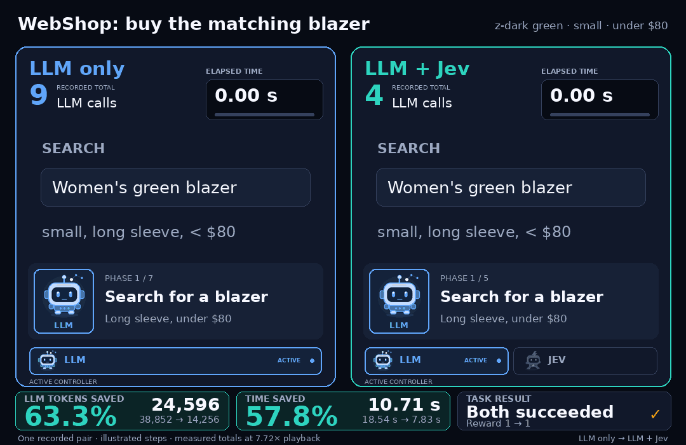
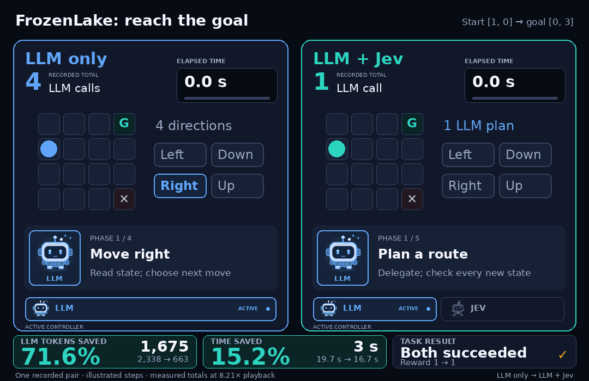
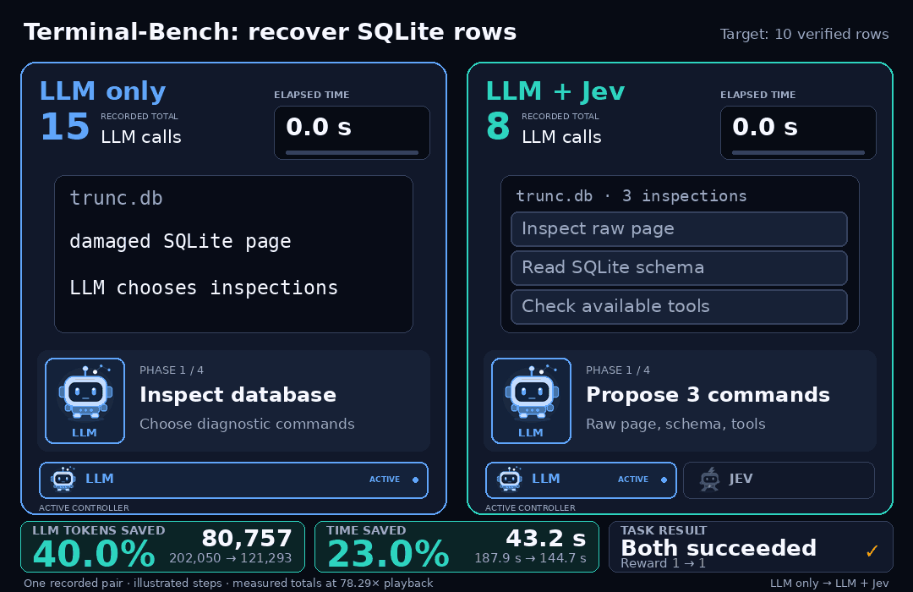
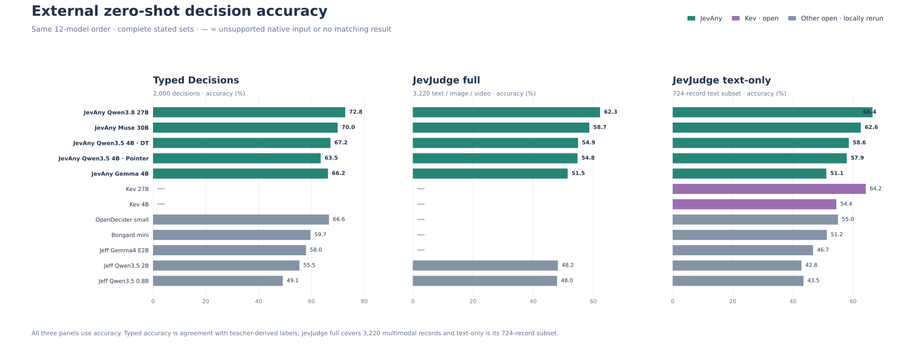
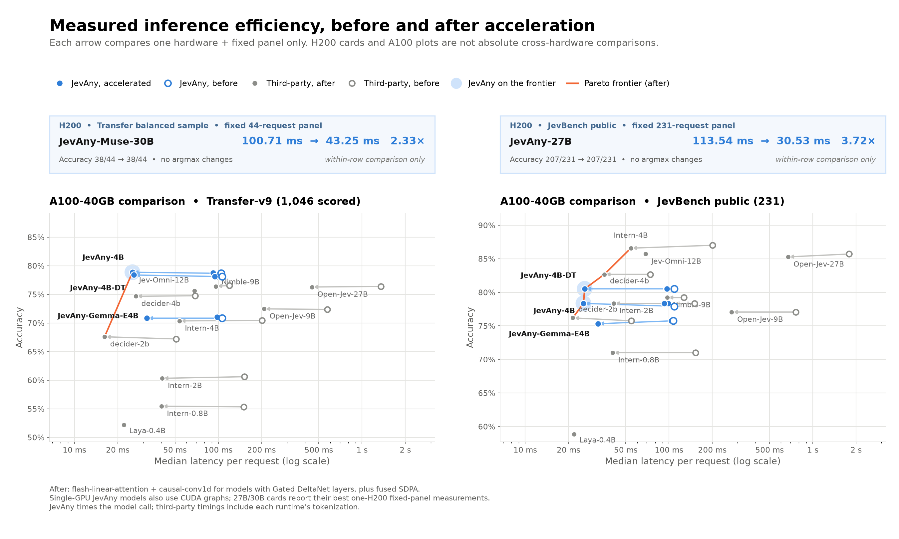
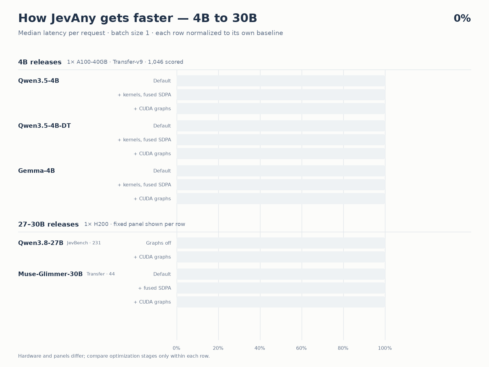
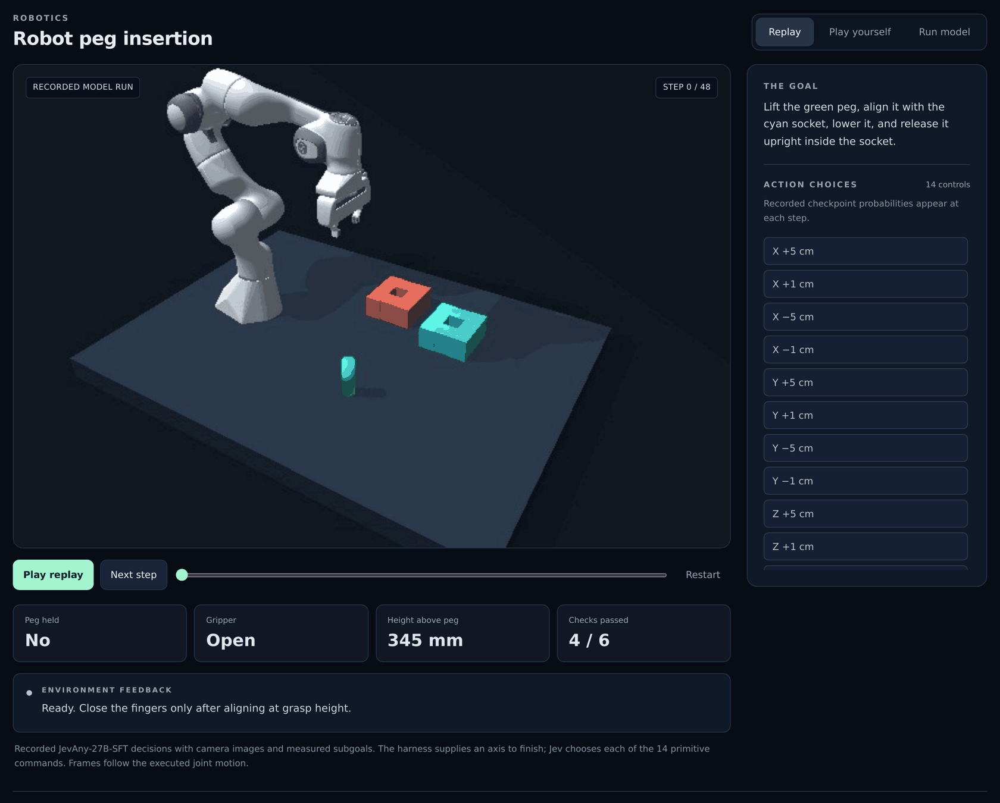
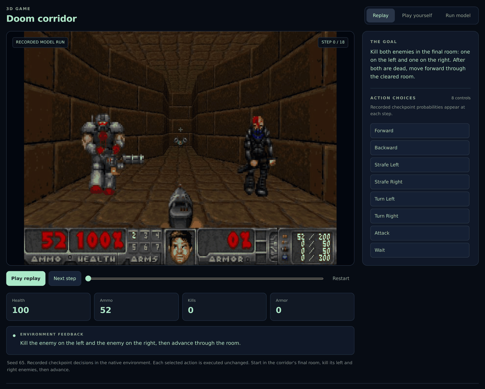
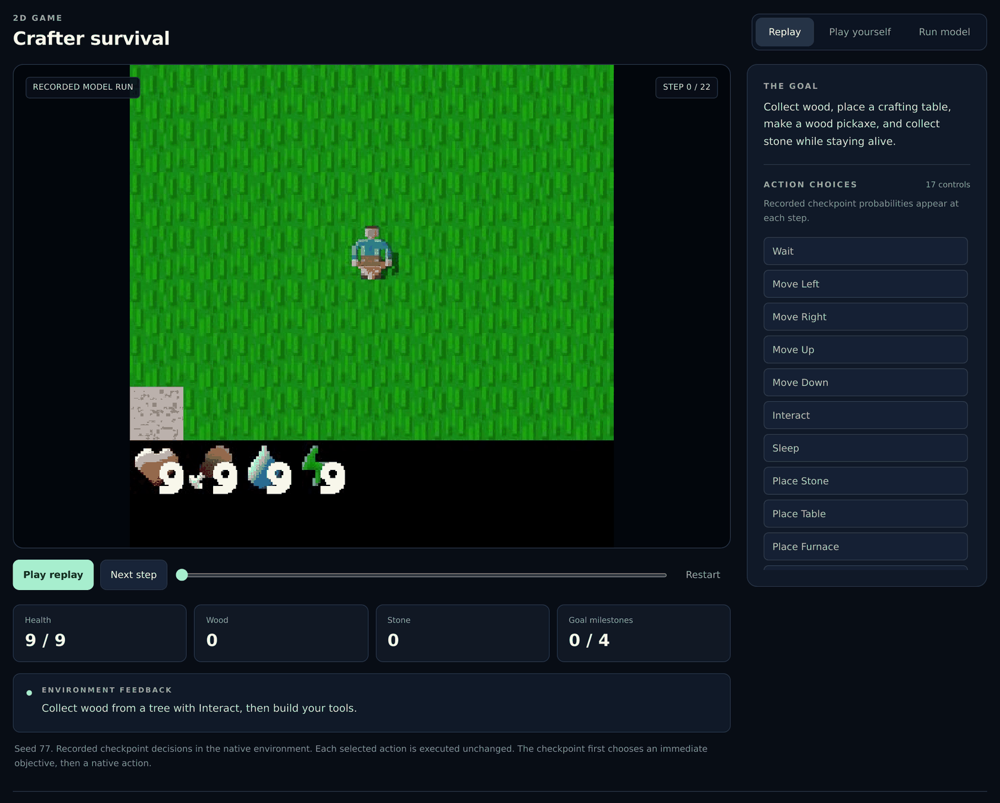

<p align="center">
  
</p>

<p align="center">
  <a href="https://simplejev.github.io/JevAny/"></a>
  <a href="https://huggingface.co/collections/SimpleJev/jevany-adaptive-decision-systems-6abc8fd39266b1c17b11b4e6"></a>
  <a href="docs/API.md"></a>
  <a href="docs/CASES.md"></a>
  <a href="pyproject.toml"></a>
  <a href="https://github.com/SimpleJev/JevAny/actions"></a>
  <a href="LICENSE"></a>
</p>

<p align="center">
  <a href="README.md">🇺🇸 English</a> | <strong>🇨🇳 简体中文</strong><br>
  <strong><a href="#结果与演示">🎮 结果与演示</a> |
  <a href="#快速上手">⚡ 快速上手</a> |
  <a href="#本地体验">💻 本地体验</a> |
  <a href="#预训练模型">🤗 模型</a> |
  <a href="#评测">📊 评测</a> |
  <a href="#文档与贡献">📚 文档</a></strong>
</p>

**JevAny 是面向 System 1 决策模型训练与部署的开源 infra**，涵盖数据准备、模型适配和评测。
你可以直接使用已发布模型，也可以用自己的数据训练，用于工单分流、工具选择和机器人动作决策。
统一 API 接收状态、问题和候选选项，直接返回选择结果与各选项概率。

<p align="center">
  
</p>

## 🎮 结果与演示 <a name="结果与演示"></a><a name="演示"></a>

[](#评测)

[完整基准测试结果与评测说明](#评测)。

以下 30 个案例是由早期兼容 checkpoint 录制的历史回放，展示了 JevAny 在机器人、浏览器、软件、实验室和出行任务中的动作选择；
当前默认发布模型为
[JevAny-Qwen3.8-27B](https://huggingface.co/SimpleJev/JevAny-Qwen3.8-27B-LoRA)。[查看全部案例](docs/CASES.md)，
或[在本地运行模型](#本地体验)，输入自己的任务，查看模型的选择和各选项概率。

[](docs/CASES.md)

### ⚡ Jev 加入 LLM Agent 循环

候选动作由环境提供或由 LLM 生成；Jev 做局部选择，规划、失败恢复和最终完成仍由 LLM 负责。
下方动图对比左侧纯 LLM 与右侧 LLM + Jev，两侧 reward 相同；步骤为示意，
加速播放保留各组记录的实测耗时比例，点击可放大查看。

**快速判断原则**

**委托“选择瓶颈”，而不是委托整个任务。** Jev 要么替代重复的 LLM 推理，
要么修正已经测出的局部排序错误；两者都做不到时，它就只是额外开销。

- 给 Jev **2–4 个有效分支**，各分支结果不同且可观察，并包含正确动作。
- 让一次 LLM 计划在多个可回退的选择间复用；遇到新状态、候选失效、
  延迟反馈、失败恢复或任务完成时交回控制权。
- 只凭配对的 reward/成本证据提升自治层级：D0 纯 LLM → D1 shadow →
  D2 单步 → D3 常规决策默认委托 → D4 有界子任务。覆盖率不等于成功。

<table>
  <tr>
    <td width="64%" valign="middle">
      <a href="docs/demos/jev-decision-webshop-v2.gif"></a>
    </td>
    <td width="36%" valign="middle">
      <p><strong>1. <a href="docs/demos/jev-agent-harness-traces.json">WebShop</a></strong><br>
      Jev 从 LLM 生成的候选中选中所需颜色和尺寸，LLM 随后完成购买。
      动作从 9 步降至 5 步，LLM 调用从 9 次降至 4 次，tokens 从 38,852
      降至 14,256，用时从 18.54 秒降至 7.83 秒。</p>
    </td>
  </tr>
  <tr>
    <td width="64%" valign="middle">
      <a href="docs/demos/jev-decision-frozen-lake-v2.gif"></a>
    </td>
    <td width="36%" valign="middle">
      <p><strong>2. <a href="docs/demos/jev-agent-harness-traces.json">FrozenLake</a></strong><br>
      LLM 规划一次路线，Jev 在每个新状态下从四个方向中选择下一步。
      两侧均用 4 步到达目标；LLM 决策调用从 4 次降至 1 次，tokens 从
      2,338 降至 663，用时从 19.7 秒降至 16.7 秒。</p>
    </td>
  </tr>
  <tr>
    <td width="64%" valign="middle">
      <a href="docs/demos/jev-decision-terminal-v2.gif"></a>
    </td>
    <td width="36%" valign="middle">
      <p><strong>3. <a href="reports/JevAny_Tech_Report_Agent_Harness_Appendix.md#h1-sqlite-recovery-a-meaningful-three-way-decision">Terminal-Bench</a></strong><br>
      在 <code>sqlite-db-truncate</code> 任务中，Jev 从三个命令中选择原始页面检查，
      LLM 随后恢复并验证十行数据。工具命令从 13 步降至 7 步，LLM 调用从
      15 次降至 8 次，tokens 从 202,050 降至 121,293，用时从 187.9 秒降至 144.7 秒。</p>
    </td>
  </tr>
</table>

下表展示更多配对评测结果，收益随任务而变化。[完整结果](reports/JevAny_Tech_Report_Agent_Harness_Appendix.md)、
[委托协议](docs/experiments/AGENT_HARNESS_FRONTIER_PROTOCOL.md)和
[技术报告](reports/JevAny_Tech_Report.pdf)说明了 Jev 适合处理哪些选择，以及何时交回 LLM。

| 任务 | 成功率 | 效率 |
|---|---:|---:|
| FrozenLake（GPT-5.6-sol，10 组配对） | 100% → 100% | LLM 调用 −64.4%，tokens −63.1%，用时 −37.6% |
| WebShop（LLM 生成候选，3 组配对） | 67% → 100% | LLM 调用 −21.4%，tokens −14.3%，用时 −15.0% |
| WebArena（6 组配对） | 50% → 50% | LLM 调用 +5.6%，tokens +28.2%，用时 −0.4% |
| Terminal-Bench（6 组配对） | 1/6 → 3/6 | LLM 调用 −9.0% |

## 📑 目录

- [🎮 结果与演示](#结果与演示)
- [⚡ 1. 快速上手](#快速上手)
  - [💻 1.1 本地体验](#本地体验)
  - [🛠️ 1.2 JevAny 训练](#训练)
  - [🚀 1.3 JevAny 部署](#部署)
- [🤗 2. 预训练模型](#预训练模型)
  - [免训练 choice-token 读出](#choice-readout)
- [📊 3. 基准测试结果](#评测)
  - [⏱️ 3.1 推理效率](#推理效率)
- [🕹️ 4. 示例与测试环境](#示例与测试环境)
- [🧩 5. 支持的模型系列](#支持的模型系列)
- [📚 6. 文档与贡献](#文档与贡献)

## ⚡ 1. 快速上手 <a name="快速上手"></a>

使用 Python 3.12 或更新版本，克隆仓库并安装轻量客户端：

```bash
git clone https://github.com/SimpleJev/JevAny.git
cd JevAny
python3.12 -m venv .venv
source .venv/bin/activate
python -m pip install -e .
```

以下命令均在仓库根目录运行，并使用上述虚拟环境。
先在本地体验，再用自己的数据[训练模型](#训练)，或通过 [API 接入应用](#部署)。

### 💻 1.1 本地体验 <a name="本地体验"></a>

选择适合自己电脑的模型：

| 模型 | 硬件 | 从这里开始 |
|---|---|---|
| Qwen 0.8B 入门配置 | CPU · 建议 16 GB 内存 | 用随包工单[训练小型 adapter](docs/TRAINING.md#start-with-a-small-backbone) |
| JevAny-Qwen 4B | CUDA · BF16 基座权重约 8 GB，另需运行时显存 | [加载已发布模型](#部署) |
| JevAny-Qwen 27B | CUDA · BF16 基座权重约 54 GB，另需运行时显存 | [选择更大的 checkpoint](docs/PLAYGROUND.md#choose-and-load-a-model) |

准备和加载步骤见[本地模型指南](docs/PLAYGROUND.md)。已发布模型首次使用时下载，
之后复用本地缓存。保持模型服务运行，在同一仓库目录打开第二个终端：

```bash
source .venv/bin/activate
jevany demo --base-url http://127.0.0.1:8008 --text-only
```

打开 `http://127.0.0.1:8090`，点击 **Test and connect**，在
**Try your own decision** 中输入任务，点击 **Ask the model**。
修改状态或候选选项，观察模型的选择如何变化。
同一界面还提供[游戏、机器人和回放](#打开交互演示)。

### 🛠️ 1.2 JevAny 训练 <a name="训练"></a>

用标注决策数据训练自己的 System 1 模型：数据沿用推理时的 `state` 和 `questions`，
为每个问题增加标签。
先用随包提供的合成客服工单开始训练，再换成自己的标注数据。入门配置在 CUDA 上
以 BF16 训练 Qwen3.5-0.8B，结果写入 `runs/my-jev`：

```bash
python -m pip install -e '.[train]'
jevany data init --out data/starter
jevany data validate data/starter/train.jsonl
jevany train --config recipes/sft.toml --dry-run
jevany train --config recipes/sft.toml
```

训练完成后，用随包提供的工单请求试用模型：

```bash
jevany decide examples/request.json --checkpoint runs/my-jev
```

通过 `--data` 指定自己的 [JSONL 数据](docs/DATA.md)，或用
[`recipes/finetune.toml`](recipes/finetune.toml) 微调已发布的 27B 模型。
CPU 配置、多模态数据和标准 `torchrun` 启动方式见[训练指南](docs/TRAINING.md)。
训练图片/视频模型或微调已发布的 27B 模型时，安装 `.[train,multimodal]`。

完成 SFT 后，可用实验性的 [RLCR](docs/ALGORITHM.md#rlcr) 继续训练，其奖励兼顾正确率与概率校准：

```bash
jevany train --config recipes/rlcr.toml
```

### 🚀 1.3 JevAny 部署 <a name="部署"></a>

安装推理依赖，在 CUDA GPU 上启动已发布的 Qwen 4B 模型。
显存要求见[硬件与加载说明](docs/DEPLOYMENT.md#checkpoints-and-hardware)。

```bash
python -m pip install -e '.[serve,multimodal]'
jevany serve --checkpoint SimpleJev/JevAny-Qwen3.5-4B-LoRA \
  --device cuda --dtype bf16 --port 8008
```

默认路径优先保证结果可复现。CUDA 部署可选择 BF16 LoRA 融合、SDPA 和
`torch.compile`，4B 与 27B 的推荐配置不同。具体命令、H200 实测数据和精度说明见
[推理加速指南](docs/DEPLOYMENT.md#optional-cuda-acceleration)。

部署自己的训练结果时，将 checkpoint ID 替换为 `runs/my-jev`。
保持服务运行，在使用相同虚拟环境的 Python 会话中，发送工单和候选处理部门：

```python
from jevany import Choice, JevClient

jev = JevClient("http://127.0.0.1:8008")
result = jev.system_one(
    state={"ticket": "I was charged twice. Please help."},
    questions={
        "department": Choice(
            instructions="Which team should handle this?",
            criteria={"billing": "Payment problems", "shipping": "Delivery problems"},
        ),
    },
)
answer = result["answers"]["department"]
print("Selected team:", answer["choice"])
print("Probabilities:", answer["probabilities"])
```

`choice` 返回一个候选部门名称，`probabilities` 返回各部门的概率。
你可以据此分配工单，也可以在结果不确定时转交人工审核。
二分类问题使用 `Noul`，例如判断工单是否需要紧急处理；有序评分使用 `Score`，
例如低、普通、高三个优先级。三类问题的完整格式见 [API 文档](docs/API.md)。

进程内推理可以[在 Python 中加载模型](docs/DEPLOYMENT.md#python)，通过相同接口调用。
图片和视频输入见[媒体配置](docs/DEPLOYMENT.md#native-media-and-limits)。

## 🤗 2. 预训练模型 <a name="预训练模型"></a>

第一次在本地运行，可以先按[本地体验](#本地体验)中的硬件要求选择模型。

| 模型 | Readout | 用途 |
|---|---|---|
| [&nbsp;JevAny-Gemma-4B](https://huggingface.co/SimpleJev/JevAny-Gemma-4B-LoRA) | Pointer | 轻量 Gemma 版本 |
| [&nbsp;JevAny-Qwen3.5-4B](https://huggingface.co/SimpleJev/JevAny-Qwen3.5-4B-LoRA) | Pointer | 轻量、支持灵活选项数 |
| [&nbsp;JevAny-Qwen3.5-4B-Direct-Token](https://huggingface.co/SimpleJev/JevAny-Qwen3.5-4B-Direct-Token-LoRA) | Direct-token | 当前 4B JevBench 最优版本 |
| [&nbsp;JevAny-Qwen3.8-27B](https://huggingface.co/SimpleJev/JevAny-Qwen3.8-27B-LoRA) | Pointer | 默认模型；当前发布准确率最高 |
| [&nbsp;JevAny-Muse-Glimmer-30B](https://huggingface.co/SimpleJev/JevAny-Muse-Glimmer-30B-LoRA) | Pointer | Muse Glimmer 版本 |

这些 LoRA adapter 采用 SFT 训练，训练数据包含 1,772,725 条文本记录和 2,180,242 个有标签决策，
配置见[训练算力与实验说明](reports/JevAny_Tech_Report.pdf)。
全参数 SFT 与进一步的后训练改进仍在计划中。

加载时还需要对应基座，并适用基座模型的许可证和访问条款。BF16 基座权重大约
需要参数量两倍的字节数，另需运行时显存。详见[硬件与加载说明](docs/DEPLOYMENT.md#checkpoints-and-hardware)。

Pointer 和 direct-token 模型使用相同 API。Pointer 在上下文允许的范围内支持最多
4,096 个选项，direct-token 最多支持 255 个。
训练与准确率的取舍见[输出方式说明](docs/TRAINING.md#pointer-and-direct-token-readouts)。

### 免训练 choice-token 读出 <a name="choice-readout"></a><a name="letter-readout"></a>

Choice-token 是一种无需额外训练的读出方式，最多支持 52 个选项：用单 token 的
`A–Z, a–z` 给选项编号，在回答位置读取这些 ID 的 logits 并重新归一化。
它既可用于冻结的基座模型，也可叠加在 Pointer / Direct-Token checkpoint 上；
与温度校准不同，它可能改变最终选出的答案。

```bash
jevany eval --run SimpleJev/JevAny-Qwen3.5-4B-Direct-Token-LoRA \
  --suite /path/to/suite --out runs/choice --device cuda --readout choice
```

[方法、命令与完整结果](docs/CHOICE_READOUT.md) ·
[机器可读结果](results/choice-readout-v2.json)

[](docs/CHOICE_READOUT.md#results)

- **最佳 4B 混合：**Direct-Token 达到 Transfer **79.83%**、Typed **67.65%**、
  JevJudge 文本 **59.25%**，比原生读出分别高 0.96、0.45 和 0.83 个点。
- **最佳 27B 混合：**Pointer 达到 Transfer **89.10%**、Typed **73.30%**，
  但 JevJudge 文本从 **66.44% 降到 64.36%**。
- **训练仍然重要：**冻结的 4B 基座在 Typed 上只有 **52.75%**，
  Direct-Token 将其提升到 **64.80%**。

在开发集上只调一个混合权重，评测前冻结；仅当原生读出与 choice 读出的错误
互补时才使用混合。温度只改变置信度，不改变 argmax。

> **指标说明：**Cygnet 的 **73.70** 是 v1.5.4 在 1,624 条公开与封闭题目上的
> 综合分，不是准确率；其可比的公开开发集准确率为 **203/231（87.9%）**。

**核心结论：**当瓶颈在于“把决策提取出来”而非推理能力时，choice-token 有帮助；
只有在目标分布的留出数据上确有提升时才保留混合。

## 📊 3. 基准测试结果 <a name="评测"></a>

下表使用各 checkpoint 的原生读出方式。
JevAny-Qwen3.8-27B 在两项评测中准确率最高，NLL 和 Brier 也最低。
4B 版本中，direct-token 的 JevBench 准确率最高，Pointer 的 Transfer 准确率最高。

[](docs/evaluation-overview.svg)

<div align="center">

| 模型 | Transfer ↑ | JevBench ↑ | NLL ↓ | Brier ↓ | ECE ↓ |
|:---|---:|---:|---:|---:|---:|
| [&nbsp;Kev-4B](https://huggingface.co/jaredpalmer/kev-4b) | 74.19% | 75.32% | 0.858 | 0.380 | 0.125 |
| [&nbsp;Kev-27B](https://huggingface.co/jaredpalmer/kev-27b) | 82.31% | 85.28% | 0.533 | 0.265 | 0.050 |
| [&nbsp;Jev 1.13.0](https://docs.typesafe.ai/models) | 85.37% | 86.58% | 0.644 | 0.212 | 0.033 |
| [&nbsp;Laya](https://huggingface.co/convaiinnovations/laya) | 52.29% | 58.01% | 1.264 | 0.615 | 0.127 |
| **JevAny Releases** |  |  |  |  |  |
| [&nbsp;JevAny-Gemma-4B](https://huggingface.co/SimpleJev/JevAny-Gemma-4B-LoRA) | 70.84% | 77.49% | 0.706 | 0.369 | 0.056 |
| [&nbsp;JevAny-Qwen3.5-4B](https://huggingface.co/SimpleJev/JevAny-Qwen3.5-4B-LoRA) | 78.68% | 80.09% | 0.587 | 0.297 | 0.035 |
| [&nbsp;JevAny-Qwen3.5-4B-Direct-Token](https://huggingface.co/SimpleJev/JevAny-Qwen3.5-4B-Direct-Token-LoRA) | 78.20% | 80.95% | 0.564 | 0.291 | **0.029** |
| [&nbsp;JevAny-Muse-Glimmer-30B](https://huggingface.co/SimpleJev/JevAny-Muse-Glimmer-30B-LoRA) | 83.46% | 87.45% | 0.464 | 0.229 | 0.032 |
| [&nbsp;**JevAny-Qwen3.8-27B**](https://huggingface.co/SimpleJev/JevAny-Qwen3.8-27B-LoRA) | **86.04%** | **90.04%** | **0.388** | **0.195** | **0.026** |

NLL、Brier 和 ECE 均在 Transfer 上计算。

</div>

[完整结果与评测协议](docs/EVALUATION.md#model-family-v2) ·
[机器可读结果](results/model-family-v2.json) ·
[方法与消融实验报告](reports/JevAny_Tech_Report.pdf)

同一组 13 个模型按准确率在 Typed Decisions、JevJudge 全集（3,220 条多模态记录）
及其 724 条文本子集上进行比较。`—` 表示不支持该输入或没有对应结果。

[](docs/external-zero-shot.svg)

- **JevAny-Qwen3.8-27B：**Typed 72.8%，JevJudge 全集 **62.3%**，文本子集 66.4%；
  其他有全集结果的模型中最强的是 Jeff-Qwen3.5-2B，为 48.2%。
- **其他基线：**Jev 1.13 的 Typed 为 72.7%，文本子集为 65.1%；Kev-27B
  文本子集为 64.2%。公开的 Decider 1 和 Liquid d1 在 Typed 上领先，
  分别为 76.8% 和 74.2%，但没有可比的全集结果。

[完整外部结果](docs/EXTERNAL_EVALUATION.md) ·
[机器可读图表数据](results/external-zero-shot-v1.json)

### ⏱️ 3.1 推理效率 <a name="推理效率"></a>

在单张 H200 上，CUDA Graph 将 Qwen3.8-27B 的中位延迟从
**113.54 ms 降至 30.53 ms（3.72×）**；融合 SDPA 加 CUDA Graph 将
Muse-Glimmer-30B 从 **100.71 ms 降至 43.25 ms（2.33×）**。
两次测量均未改变 argmax。下表对 27B 与 30B 使用 H200 headline 实测，
对 4B 保留同硬件 A100-40GB 对照。每个加速比只在同一行内比较；H200
与 A100 使用不同固定面板，不能横向比较绝对延迟。

[](docs/EFFICIENCY.md)

| 模型 | 硬件 | 加速前 | 加速后 | 加速比 | 准确率检查 | 固定面板 |
|:---|:---:|---:|---:|---:|---:|:---|
| JevAny-Qwen3.5-4B | A100 | 104.6 ms | **25.3 ms** | **4.1×** | 78.68% → 78.87% | Transfer，1,046 |
| JevAny-Qwen3.5-4B-Direct-Token | A100 | 106.4 ms | **25.9 ms** | **4.1×** | 78.11% → 78.39% | Transfer，1,046 |
| JevAny-Gemma-4B | A100 | 106.3 ms | **31.9 ms** | **3.3×** | 70.84% → 70.84% | Transfer，1,046 |
| JevAny-Muse-Glimmer-30B | H200 | 100.71 ms | **43.25 ms** | **2.33×** | 86.36% → 86.36% | Transfer 样本，44 |
| JevAny-Qwen3.8-27B | H200 | 113.54 ms | **30.53 ms** | **3.72×** | 89.61% → 89.61% | JevBench public，231 |

中位模型调用延迟，串行 batch size 1。完整报告保留同硬件 A100 对照与面板限制。

[](docs/EFFICIENCY.md)

<p align="center"><sub>A100 上的 4B 与 H200 上的 27–30B。每行按各自 baseline 归一化，只在行内比较优化阶段。</sub></p>

[完整表格、实验设置与其他模型](docs/EFFICIENCY.md) ·
[开启方法](docs/DEPLOYMENT.md#optional-cuda-acceleration) ·
[H200 机器可读结果](results/efficiency-h200-best-v1.json) ·
[A100 机器可读结果](results/efficiency-a100-v1.json)

## 🕹️ 4. 示例与测试环境 <a name="示例与测试环境"></a>

交互演示包含以下三个环境。动图保留历史模型的动作和选项概率；当前
[JevAny-Qwen3.8-27B](https://huggingface.co/SimpleJev/JevAny-Qwen3.8-27B-LoRA)
可按 playground 指南中的命令运行。

### 🤖 4.1 [机械臂插孔](examples/README.md#robot-peg-insertion) <a name="机械臂插孔"></a>

控制 Franka 夹爪抓取、对准并插入工件，由 PyBullet 接触物理验证结果。

[](examples/README.md#robot-peg-insertion)

### 🔫 4.2 [Doom 走廊 · 3D](examples/README.md#doom-corridor-3d) <a name="doom-走廊-3d"></a>

击败最后一个房间中左右两侧的敌人，再向前移动。使用 ViZDoom 和随包提供的 Freedoom 资源。

[](examples/README.md#doom-corridor-3d)

### ⛏️ 4.3 [Crafter 生存建造 · 2D](examples/README.md#crafter-survival-2d) <a name="crafter-生存建造-2d"></a>

采集木材、制作工具、开采石头，同时管理生命值和物资。

[](examples/README.md#crafter-survival-2d)

### 🎮 4.4 打开交互演示 <a name="打开交互演示"></a>

按[本地体验](#本地体验)启动模型后，打开交互演示：

```bash
jevany demo --base-url http://127.0.0.1:8008 --text-only
```

打开 `http://127.0.0.1:8090`，点击 **Test and connect**，尝试自己的决策任务。
要让模型操作游戏，安装可选引擎并重新启动演示：

```bash
python -m pip install -e '.[demo]'
jevany demo --base-url http://127.0.0.1:8008 --text-only
```

在浏览器中选择 **Run model**，再点击 **One decision** 单步运行，或
**Run automatically** 连续运行。选择 **Play yourself** 可以自己操作。
实时控制向模型发送文本状态；机械臂控制使用 `.[robotics]` 依赖。

观看内置录制内容时，运行 `jevany demo` 并选择 **Replay**，只需 CPU，无需模型权重。
平台要求与环境接口见[演示指南](examples/README.md)，结合 LLM 规划器使用
JevAny 决策可参考[集成文档](docs/INTEGRATIONS.md)。

## 🧩 5. 支持的模型系列 <a name="支持的模型系列"></a>

[模型 ID、支持的输入与运行要求](docs/TRAINING.md#backbone-support)。

[](docs/TRAINING.md#backbone-support)

## 📚 6. 文档与贡献 <a name="文档与贡献"></a>

[训练](docs/TRAINING.md) · [部署](docs/DEPLOYMENT.md) · [API](docs/API.md) · [数据](docs/DATA.md) · [评测](docs/EVALUATION.md) · [Agent harness 协议](docs/experiments/AGENT_HARNESS_FRONTIER_PROTOCOL.md) · [贡献指南](CONTRIBUTING.md)

欢迎贡献模型适配、评测或应用示例，开发步骤见[贡献指南](CONTRIBUTING.md)。
[技术报告](reports/JevAny_Tech_Report.pdf)介绍了模型设计、多模态路径、
agent-harness 实验与附录、负面结果和开放问题。

代码和入门数据采用 Apache-2.0。部分组件改编自 [Kev](https://github.com/jaredpalmer/kev)，
归属说明见 [NOTICE](NOTICE) 和 [ACKNOWLEDGEMENTS.md](ACKNOWLEDGEMENTS.md)。
基座模型与上游数据集保留各自条款。
