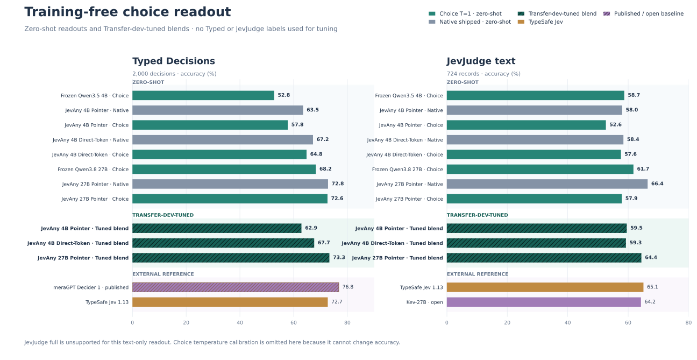

# Training-free choice-token readout

Choice-token readout turns an ordinary causal language model into a decision
readout without adding or training a head:

1. Preserve the candidate order and assign the exact one-character IDs
   `A–Z, a–z`.
2. Ask for one case-sensitive option ID with thinking disabled.
3. At the answer position, sum the mass of every vocabulary token that decodes
   exactly to each available ID.
4. Renormalize over the available IDs and map the distribution back to the
   original option keys.

This operation can change the ranking and the selected answer. It is therefore
not temperature calibration. A scalar temperature changes probability values
but cannot change argmax accuracy. A native + choice stack is a third operation:
it pools two distributions and can change the answer.

The same readout works on a frozen base model or after loading a JevAny Pointer
or Direct-Token adapter. No additional readout training is performed.

## Use it

The checkpoint-native readout remains the default. Select choice-token readout
with `--readout choice`:

```bash
jevany eval \
  --run SimpleJev/JevAny-Qwen3.5-4B-Direct-Token-LoRA \
  --suite /path/to/jevbench-public-v1.4.2.2 \
  --out runs/choice-readout/qwen35-4b-direct \
  --device cuda --readout choice --choice-temperature 1.0

jevany decide request.json \
  --checkpoint SimpleJev/JevAny-Qwen3.5-4B-LoRA \
  --device cuda --dtype bf16 --readout choice

jevany serve \
  --checkpoint SimpleJev/JevAny-Qwen3.5-4B-LoRA \
  --device cuda --dtype bf16 --readout choice
```

Use `--choice-native-weight` to pool the choice and checkpoint-native
distributions. This executes both paths. `--choice-max-tokens` controls the
choice prompt limit. The former `letter` selector and `--letter-*` flags remain
hidden compatibility aliases.

The matrix evaluator also accepts a frozen base directly:

```bash
python -m scripts.evaluate_choice_readout_matrix \
  --base Qwen/Qwen3.5-4B \
  --revision 851bf6e806efd8d0a36b00ddf55e13ccb7b8cd0a \
  --base-load-path /path/to/Qwen3.5-4B \
  --model-name Frozen-Qwen3.5-4B \
  --out runs/choice-readout/base4 \
  --jevbench /path/to/jevbench-public-v1.4.2.2 \
  --transfer /path/to/transfer-v9 \
  --typed /path/to/typed-decisions \
  --jevjudge /path/to/jevjudge-public
```

## Limits

- Text input only; JevJudge full multimodal is unsupported and is never
  converted into a text-only score.
- 1–52 options per question.
- Exact one-token aliases must exist in the tokenizer for every used ID.
- Choice-only runs use one chat-formatted prefill per question. A stack also
  executes the checkpoint-native prefill.
- Matrix runs use exact math SDPA below 8,192 tokens and memory-linear fused
  SDPA for longer prompts. All 724 JevJudge text records complete; no record is
  truncated or rejected.

## Evaluation protocol

The v2 matrix uses the same prompt and data for five runs:

- frozen Qwen3.5-4B;
- JevAny Qwen3.5-4B Pointer;
- JevAny Qwen3.5-4B Direct-Token;
- frozen Qwen3.8-27B;
- JevAny Qwen3.8-27B Pointer.

Zero-shot rows use T=1 and no evaluation-label tuning. For tuned rows, each
model selects one native weight on the 1,046 clean/knowable Transfer-v9
development decisions; fitted NLL and distance from 0.5 break accuracy ties.
One additional temperature is then fitted on the same development rows. The
weight and temperature are frozen before Transfer test, Typed Decisions,
JevJudge text, and the JevBench public diagnostic are scored.

The native parity gates reproduce the released README results before any
held-out panel runs:

| Checkpoint | Transfer development | JevBench public |
|---|---:|---:|
| JevAny 4B Pointer | 823/1,046 · 78.68% | 185/231 · 80.09% |
| JevAny 4B Direct-Token | 818/1,046 · 78.20% | 187/231 · 80.95% |
| JevAny 27B Pointer | 900/1,046 · 86.04% | 208/231 · 90.04% |

## Results



All values below are accuracy. JevBench is its 231-item public development
diagnostic. Transfer test contains 1,046 clean/knowable held-out decisions.
Typed covers 2,000 decisions in 400 test cases. JevJudge text covers all 724
text records; it is not the 3,220-record multimodal suite.

| Weights | Readout | JevBench public | Transfer test | Typed test | JevJudge text |
|---|---|---:|---:|---:|---:|
| Frozen Qwen3.5-4B | Choice T=1 | 79.65% | 68.45% | 52.75% | 58.70% |
| JevAny 4B Pointer | Native shipped | 80.09% | 77.92% | **63.50%** | 58.01% |
|  | Choice T=1 | **81.39%** | 73.61% | 57.80% | 52.62% |
|  | Tuned stack · w=.78 | 80.95% | **78.01%** | 62.90% | **59.53%** |
| JevAny 4B Direct-Token | Native shipped | 80.95% | 78.87% | 67.20% | 58.43% |
|  | Choice T=1 | **81.39%** | 78.59% | 64.80% | 57.60% |
|  | Tuned stack · w=.59 | 80.95% | **79.83%** | **67.65%** | **59.25%** |
| Frozen Qwen3.8-27B | Choice T=1 | 87.88% | 80.69% | 68.25% | 61.74% |
| JevAny 27B Pointer | Native shipped | **90.04%** | 87.95% | 72.80% | **66.44%** |
|  | Choice T=1 | 89.61% | 86.04% | 72.60% | 57.87% |
|  | Tuned stack · w=.52 | **90.04%** | **89.10%** | **73.30%** | 64.36% |

The fixed, untuned 50/50 stacks remain a separate zero-shot reference:

| Checkpoint | JevBench public | Transfer test | Typed test | JevJudge text |
|---|---:|---:|---:|---:|
| JevAny 4B Pointer | 81.39% | 77.44% | 60.70% | 59.12% |
| JevAny 4B Direct-Token | 80.95% | 79.45% | 66.75% | 58.98% |
| JevAny 27B Pointer | 90.04% | **89.20%** | 73.20% | 64.23% |

The selected parameters differ by checkpoint:

| Checkpoint | Native weight | Additional temperature |
|---|---:|---:|
| JevAny 4B Pointer | .78 | 1.10 |
| JevAny 4B Direct-Token | .59 | 1.12 |
| JevAny 27B Pointer | .52 | .84 |

### External comparison

| Model/readout | Typed test | JevJudge text |
|---|---:|---:|
| meraGPT Decider 1 · published | **76.80%** | — |
| JevAny 27B Pointer · native | 72.80% | **66.44%** |
| JevAny 27B Pointer · tuned stack | **73.30%** | 64.36% |
| TypeSafe Jev 1.13 | 72.70% | 65.06% |
| Kev-27B | — | 64.23% |

The 27B stack beats its native readout by 12 held-out Transfer decisions and
10 Typed decisions, while losing 15 JevJudge text decisions. Direct-Token 4B's
stack improves over native on all three held-out panels. Pointer 4B improves on
Transfer and JevJudge but loses on Typed. No single blend is universally best.

### Practical principles

- **Selection bottleneck:** use choice-token readout when the model can reason
  over the candidates but the native extraction path is the bottleneck.
- **Complementary errors:** keep a stack only when paired development results
  show that each readout rescues errors made by the other. Select one weight on
  development data and freeze it.
- **Capability limit:** a different readout cannot supply knowledge, perception,
  planning, or instruction-following ability missing from the underlying model.
- **Calibration limit:** temperature can improve NLL, Brier, or ECE, but it
  cannot change the selected option or accuracy.
- **Domain shift:** target-domain validation wins over a global rule. The same
  27B stack helps Transfer and Typed, ties JevBench, and hurts JevJudge text.

Complete metrics, hashes, runtime versions, selected weights, and the unsupported
full-JevJudge marker are in
[`results/choice-readout-v2.json`](../results/choice-readout-v2.json). The
deterministic builder is
[`scripts/build_choice_readout_results.py`](../scripts/build_choice_readout_results.py).

## Benchmark units

Cygnet's official `73.70` on JevBench v1.5.4 is a four-axis composite over
1,624 open and sealed decisions, not accuracy. Its separate public-development
result is 203/231 (87.9% accuracy). Every JevBench value on this page is
accuracy over the same 231 public-development items and cannot be compared
numerically with the composite.

## Historical v1

The original prompt-v1 experiment and one-panel latency diagnostic remain
unchanged in [`results/letter-readout-v1.json`](../results/letter-readout-v1.json)
and [`letter-readout-results.svg`](letter-readout-results.svg). Those runs used a
different prompt and runtime, and their matched native reruns did not reproduce
the canonical README rows. They are retained for audit and are not mixed into
the v2 tables.

## Attribution

The Cygnet-compatible prompt and exact option-ID aggregation semantics are
adapted from `blockbrain-ai/cygnet-recipe` commit `3cf591c`, Copyright 2026
Nood Co and contributors, under MIT. Cygnet credits the one-token option-ID
readout to [NInfer](https://github.com/igorls/ninfer), released under Apache-2.0.
JevAny does not incorporate NInfer source code. See [`NOTICE`](../NOTICE).
