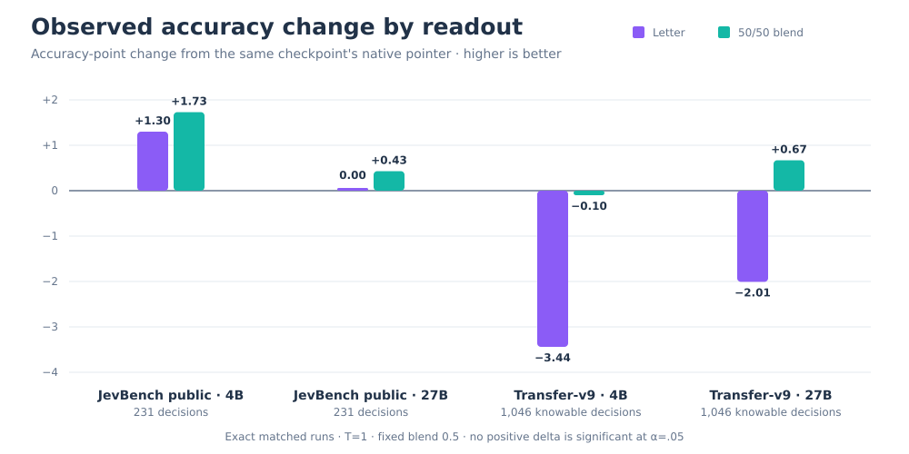

# Training-free option-letter readout

JevAny includes an experimental evaluator for a training-free, single-answer-slot
decision readout. It adapts the prompt and probability-aggregation semantics
from [Cygnet](https://github.com/blockbrain-ai/cygnet-recipe/tree/3cf591c692dec649f7c134449814610307c7bb3a):

1. Render the options in their original order as `A`, `B`, …, `Z`.
2. Ask the model for exactly one option letter with thinking disabled.
3. At the answer position, collect every vocabulary token whose decoded surface
   is exactly each available uppercase letter. This emulates Cygnet's
   `structured_outputs.choice` mask; leading-space, punctuated, and lowercase
   forms are not admitted.
4. Sum duplicate-token mass per letter and normalize over the available options.
5. Optionally apply a temperature fitted for that model and evaluation domain.

The model produces no explanation and the method needs no additional training.
The same readout can be applied after loading a JevAny LoRA. For pointer
checkpoints, the letter and native pointer distributions can also be combined
log-linearly. The integrated commands call this knob
`--letter-pointer-weight`; the standalone experiment script calls it
`--pointer-weight`.

## Run the public diagnostic

Use `--readout letter` to score a JevAny checkpoint on any regular frozen suite
or labelled JSONL. This example keeps temperature at 1 rather than copying a
value fitted for another model:

```bash
jevany eval \
  --run SimpleJev/JevAny-Qwen3.5-4B-LoRA \
  --suite /path/to/jevbench-public-v1.4.2.2 \
  --out runs/letter-readout/qwen35-4b \
  --device cuda --readout letter --letter-temperature 1.0
```

The same selector works for one local decision or an HTTP deployment. Native
checkpoint readout remains the default when `--readout` is omitted:

```bash
jevany decide request.json \
  --checkpoint SimpleJev/JevAny-Qwen3.5-4B-LoRA \
  --device cuda --dtype bf16 --readout letter

jevany serve \
  --checkpoint SimpleJev/JevAny-Qwen3.5-4B-LoRA \
  --device cuda --dtype bf16 --readout letter
```

The standalone evaluator additionally supports a frozen base via `--base`,
tier sampling, and explicit LoRA scaling:

```bash
python scripts/evaluate_letter_readout.py \
  --checkpoint SimpleJev/JevAny-Qwen3.5-4B-LoRA \
  --suite /path/to/jevbench-public-v1.4.2.2 \
  --out runs/letter-readout/qwen35-4b \
  --device cuda --dtype bf16 --temperature 1.0
```

Add `--sample-per-tier 1` for a three-record smoke test. Use
`--lora-scale 0` with a checkpoint to evaluate its exact pinned base without
the adapter. A nonzero `--pointer-weight` requires a native pointer checkpoint
and adds a second, pointer-formatted model pass per request.

Current limits:

- text-only model input;
- 1–26 options per question;
- safetensors weights for models with an untied language-model output head;
- one letter-formatted prefill per question, plus one native prefill when
  pointer blending is enabled;
- native inference-limit and CUDA-graph flags do not apply to the chat-formatted
  letter path; use `--letter-max-tokens` for its prompt limit.

Temperature changes reported probabilities but does not change the letter-only
argmax. Fit it on a separate calibration split for each model. Cygnet's `3.4`
was fitted for its own Gemma configuration and is not a default for JevAny.

## Benchmark units

The official score and the public diagnostic answer different questions:

| Result | Evaluation set | Unit |
|---|---:|---|
| Cygnet 73.70 | JevBench v1.5.4, 1,624 decisions: 904 open + 720 sealed | Equal-weight harmonic mean of Intelligence, Calibration, Speed and Cost |
| Cygnet 203/231 (87.9%) | Public development set, 231 decisions | Accuracy |
| JevAny results in the current README | Same public development set, 231 decisions | Accuracy |

Cygnet ranks first among 106 systems on the official v1.5.4 composite and is a
statistical tie with Winnow-12B Q8. The 73.70 composite is not `73.70%` and
cannot be compared numerically with public-set accuracy. See Cygnet's
[official-submission report](https://github.com/blockbrain-ai/cygnet-recipe/pull/4)
and the [JevBench v1.5.4 board](https://benchmarkheaven.com/jev-models/v1.5.4).

## Results

All JevAny values below are local pinned-checkpoint runs at temperature 1. The
complete metrics, suite hashes, report hashes, and paired counts are in
[`results/letter-readout-v1.json`](../results/letter-readout-v1.json).
These are separate matched reruns of the pinned released checkpoints for this
ablation; they do not replace the main model-family table, whose frozen
checkpoints and run provenance differ.



JevBench public is a 231-question development diagnostic, not the sealed
v1.5.4 board. `Base + letter` disables the JevAny adapter; the other columns use
the released adapter. Deltas and two-sided exact McNemar p-values compare each
adapter readout with the native pointer on the same questions.

| Model | Base + letter | Native | Letter | Fixed 50/50 blend |
|---|---:|---:|---:|---:|
| Qwen3.5-4B | 79.65% | 80.09% | 81.39% (+1.30, p=.749) | **81.82%** (+1.73, p=.424) |
| Qwen3.8-27B | 88.31% | 89.61% | 89.61% (+0.00, p=1.000) | **90.04%** (+0.43, p=1.000) |

Transfer-v9 evaluates all 1,264 requests without rejection or truncation. Its
accuracy headline uses the 1,046 clean knowable decisions.

| Model | Native | Letter | Fixed 50/50 blend |
|---|---:|---:|---:|
| Qwen3.5-4B | **79.16%** | 75.72% (-3.44, p=.0028) | 79.06% (-0.10, p=1.000) |
| Qwen3.8-27B | 86.23% | 84.23% (-2.01, p=.0375) | **86.90%** (+0.67, p=.337) |

The 27B blend gets 909/1,046 decisions right versus 902/1,046 for native, but
the seven-question gain is not statistically significant. The fixed blend is
also not a universal improvement: at 4B it gets one fewer answer right. None of
the positive gains in either table is significant at the 0.05 level. The
letter-only Transfer-v9 losses show that a public-diagnostic gain does not by
itself establish transfer.

## Latency diagnostic

One warmed run per mode on H200/BF16 measured the same heterogeneous 231-record
panel with 16 warmups, one measured repeat, and concurrency 1. Values are external
end-to-end median / p95 milliseconds; loading and network transport are
excluded.

| Model | Native | Letter | Fixed 50/50 blend |
|---|---:|---:|---:|
| Qwen3.5-4B | 138.43 / 200.98 | **131.86** / 201.55 (1.05x median speedup) | 250.34 / 388.31 (1.81x median latency) |
| Qwen3.8-27B | 194.70 / 477.67 | **181.58** / 492.51 (1.07x median speedup) | 367.40 / 943.44 (1.89x median latency) |

Letter-only has a modest median improvement on this panel despite using more
logical input tokens on average (701 versus 602); p95 does not improve. The
blend evaluates both prefills and averages 1,303 logical input tokens. This is
not saturated server throughput or a general speed claim.

## Practical principles

- Treat letter readout as a model-and-domain ablation, not a drop-in upgrade.
  Keep it only after a paired evaluation on the target decision distribution.
- Blend only when the two readouts make complementary errors. The fixed 50/50
  pool helped 27B on both diagnostics; at 4B it helped JevBench public but not
  Transfer-v9. Select the weight on a separate development split.
- Calibrate each model, readout, and domain separately. Cygnet's fitted
  temperature `3.4` does not transfer to these Qwen checkpoints.
- Re-measure latency in the deployment runtime and traffic mix. The one-pass
  letter path can trim median latency, while blending requires both letter and
  native passes and nearly doubles median latency here.

## Attribution

The Cygnet-compatible prompt and aggregation semantics are adapted from
`blockbrain-ai/cygnet-recipe` commit
`3cf591c692dec649f7c134449814610307c7bb3a`, Copyright 2026 Nood Co and
contributors, under MIT. Cygnet credits the one-token option-letter readout
method to [NInfer](https://github.com/igorls/ninfer), released under Apache-2.0.
JevAny does not incorporate NInfer source code. See [NOTICE](../NOTICE) for the
full Cygnet license notice.
